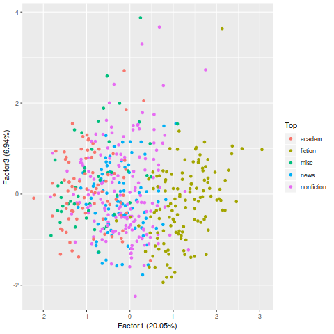

# Multilingual Python version for Biber's Multi-Dimensional Analysis (MDA)

This is a Python version of Biber's tagger for English, French, Russian and Spanish as well as R scripts for Multi-Dimensional Analysis.

Back in 1988 Doug Biber developed an approach to analysing the composition of a corpus by using a set of extractable features and factor analysis, see his first book on the topic:
[https://books.google.co.uk/books?id=CVTPaSSYEroC]

An article-length description is available from [http://www.aclweb.org/anthology/J93-2001]

While this approach is more than 30-years old by now, his attention to designing extractable features is still important for understanding how linguistic features vary in texts of different kinds.  The features proposed by Biber include:

* Lexical features, such as:
  * publicVerbs = *acknowledge, admit, agree, assert, claim, complain, declare, deny...*
  * timeAdverbials  = *afterwards, again, earlier, early, eventually, formerly, immediately,...*
  * amplifiers = *absolutely, altogether, completely, enormously, entirely,...*
* Part-of-speech features, such as:
  * Nominalisations (nouns ending in *-tion, -ness, -ment*)
  * Prepositions
  * Past tense verbs
* Syntactic features, such as:
  * *be* as the main verb
  * *that* deletions
  * pied piping (as in *Which house did she buy ...?* where *house* moved from its expected position after *buy*)
* Text-level features, such as:
  * Average word length
  * Average sentence length
  * Type/token ratio

In our Intellitext project (2011-2012) we have implemented these features in a [Web interface to corpora](http://corpus.leeds.ac.uk/it/) in Perl, see:
```
@inproceedings{wilson10paclic,
  title={Advanced corpus solutions for humanities researchers},
  author={Wilson, James and Hartley, Anthony and Sharoff, Serge and Stephenson, Paul},
  booktitle={Proc PACLIC 24},
  pages={36--43},
  month={November},
  address={Tohoku University},
  year={2010},
  pdf={http://www.aclweb.org/anthology/Y10-1089}
}
```

Since then, I ported the feature extractor from Perl to Python to help with my research on text classification.  Also I have ported the available word lists to French and Russian, and Gonzalo Cruz done this for Spanish, so that the Biber dimensions of variation can be extracted across languages.

The arguments for the script are self-explanatory (run `python3 biber-dim.py -h`).  A typical invocation would be:

`python3 biber-dim.py -l en -t brown.ol >brown.dat`

The format for the corpus file is one line per document.  The script assumes that the folder contains a file with language-specific properties with the name LANGUAGE.properties and a frequency list with the name LANGUAGE.tag.num.  The format of the lists of properties is as follows:
```
privateVerbs = anticipate,assume,believe,conclude,decide,demonstrate
```

The property ids are fixed (the label `privateVerbs` is used for all languages), while the word lists are language-specific.  If the language is set to `en', extra rules apply, e.g., for detecting /by passives/ (such categories will not be detected for other languages).

The POS tags and lemmas are coming from a frequency list:

num | word | lemma | pos | UD morph
----|------|-------|-----|------
1625260 | years | year | NOUN | Number=Plur
399401  | went  | go   | VERB | Tense=Past


This can be obtained, for example, from an available CONLLU file with the annotations in the format of the [Universal Dependencies](http://universaldependencies.org) by

`cut -f 2-4,6 -s CONLLU.file | sort | uniq -c | sort -nsr >CONLLU.num`


My `biber-dim.py` script produces a tab-separated table with values for each dimension.  This can be taken to R for factor analysis and plot making:

`Rscript biber-mda.R brown-biber.dat brown-annot.dat`

The annot.dat file is optional.  It assigns each text in the original ol file to a genre category, so that the texts can be displayed on a plot with meaningful annotations.  Here is the plot for the Brown Corpus top-level genre categories:


